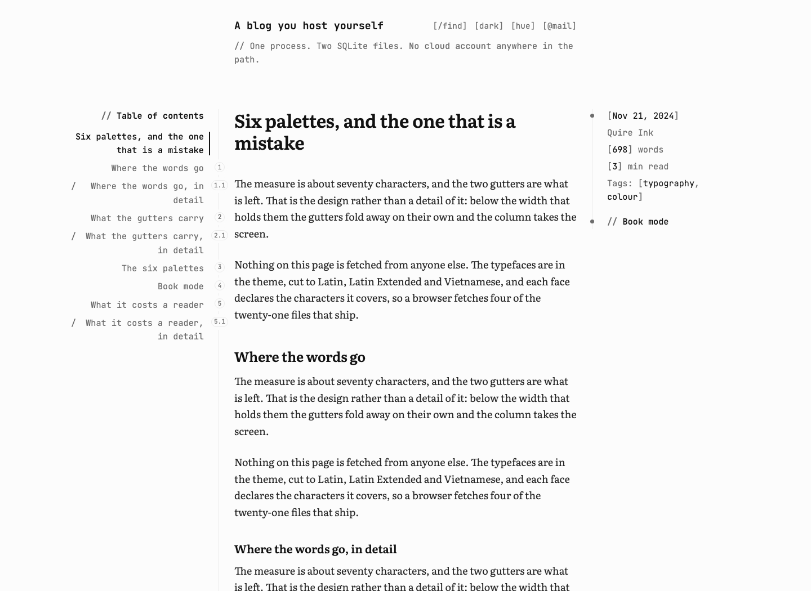

<div align="center">

# Quire Ink for Ghost

`0.1.0`

**A Ghost theme for people who write long things and want them read.**
The reading surface of the [Quire Ink](https://quireink.com) blog engine, generated from that
engine's own stylesheet rather than copied by hand.
No font host, no analytics, no request the theme makes off your own domain.

[](https://github.com/joiha-steven/quireink-ghost-theme/actions/workflows/ci.yml)


**English** · [Tiếng Việt](./README.vi.md)

[**Quire Ink**](https://quireink.com) ·
[**the engine**](https://github.com/joiha-steven/quireink) ·
[**the WordPress port**](https://github.com/joiha-steven/quireink-wordpress-theme) ·
[**what you get**](#what-you-get) ·
[**what it costs a reader**](#what-it-costs-a-reader) ·
[**what does not carry over**](#what-does-not-carry-over) ·
[**install**](#install)



<sub>An article at the width that holds three columns. The middle one is about seventy
characters wide and the two gutters are what is left, which is the design rather than a detail
of it. Below that width the gutters fold away on their own and the column takes the screen.</sub>

</div>

## What it is

A theme for a blog whose point is the writing.

A reader opens a post and gets one column in a book face, the article's own contents standing
in the gutter beside it, and its facts in the gutter on the other side. They can pick one of six
palettes in light or dark and the site remembers it. The six typefaces are in the theme, so a
stranger on a weak signal is waiting for your words and not for a font host.

Everything visual is **generated** from the Quire Ink blog engine's own stylesheet — the same
sheet that blog renders with. Not an impression of it, and not a copy that drifts: the extractor
runs the engine's emitters and a static check compares bytes.

Nothing of yours is locked in. No custom post type, no taxonomy, no database table. Switch away
and every post is still a post.

## What you get

| The part | What it does |
|:---|:---|
| 📐&nbsp;**The&nbsp;page** | One column of about seventy characters, the contents of the post in one gutter and its facts in the other. Below the width that holds them, both fold away without a second layout to maintain |
| 🎨&nbsp;**Colour** | Six palettes, each in light and dark, chosen by the reader and remembered on their device. Every one clears WCAG AA against its own background, and a static check re-measures all sixty colours on every run |
| 🔤&nbsp;**Type** | Six typefaces in the theme, all OFL, cut to Latin, Latin Extended and Vietnamese. Twenty-one files ship and a browser fetches four, because each face declares the characters it covers |
| 📖&nbsp;**Book&nbsp;mode** | The article reset in two columns with a drop cap, sized from the window, with the reader's place kept |
| ✒️&nbsp;**Book&nbsp;typography** | Indented paragraphs, justified lines, hyphenation at the break. Off by default, because it is a taste and not an improvement |
| 🗓️&nbsp;**The&nbsp;listing** | A spine down the gutter with a sticky year and a marker at each new month, positioned against cards that are already there |
| 🔍&nbsp;**Search** | The engine's own overlay, opening on `/` from anywhere on the page, reading Ghost's Content API |
| 💻&nbsp;**Terminal&nbsp;chrome** | Bracketed tokens instead of icons and numbered rail rows, switchable off |
| ⚙️&nbsp;**Nine&nbsp;settings** | Palette, reader palette switching, default light/dark, terminal chrome, book typography, list thumbnails, feature image, tagline, footer credit — all in Ghost's own design panel |

## What it costs a reader

Measured with `bun run check:filesize`, gzipped where a server would gzip it, counting the four
font files a Latin or Vietnamese browser actually fetches out of the twenty-one that ship.

| | |
|:---|---:|
| Stylesheets (five, gzipped) | 51.9 KB |
| Scripts (three, gzipped) | 15.4 KB |
| Fonts (the two faces a first article needs) | 53.8 KB |
| **A first article** | **121.2 KB** |
| The theme folder, as uploaded | 674 KB |

**One caveat, and it is not the theme's to fix.** Ghost itself injects Portal and its search
script from `cdn.jsdelivr.net` on every page, whether or not a theme uses them. The theme adds
no third-party request; the page still makes two. A self-hosted Ghost can be configured to serve
them from its own origin. [`docs/gaps.md`](docs/gaps.md) has the measurement.

## What does not carry over

The short version. [`docs/gaps.md`](docs/gaps.md) has the measurements and
[`docs/decisions/`](docs/decisions/README.md) has the reasoning.

- **The pen, the highlighter and footnotes.** 273 KB of generated SVG keyed on attributes only
  Quire Ink's own editor writes. Koenig cannot author one, so the sheet is not shipped.
- **Series, and the rail's archive block.** Ghost has tags and authors and no date route. An
  **Authors** block stands where categories did. The gutter timeline is unaffected and ships —
  it points at nothing, so it needs no routes.
- **Right to left.** The WordPress port gets a generated mirror for free because WordPress links
  `rtl.css` by itself. Ghost has no such convention. Not refused, just not built.
- **The comment thread is Ghost's.** Sign-in, replies and moderation are the platform's and are
  good; the trade is that Ghost renders them in an iframe this theme cannot style inside.
- **A callout keeps its emoji and loses its colour.** Ghost's eight pastel backgrounds plus the
  engine's accent rule is the same idea said twice, and a bright slab on a dark palette.

## Install

Download the zip from Releases — or build it:

```bash
bun run zip
```

Then **Ghost → Settings → Design → Change theme → Upload theme**, and pick the zip. Nine
settings live under the palette icon in that same panel.

Two things worth doing after: put a couple of links in **Navigation** so the rail's menu block
has something in it, and mark two or three posts **featured** so the Featured block appears.

## Working on it

```bash
dev/up.sh        # Ghost on http://localhost:2368 with the theme mounted live
dev/seed.sh      # an owner, the theme activated, ten posts across three years, a page, a menu
bun run check:all
```

`bun run extract` re-runs the generator against the sibling `../quireink` checkout. Everything
under `assets/css/quireink-*`, `assets/fonts/`, `assets/js/{core,post}.js` and
`partials/generated-*` comes from there and is overwritten by it.

[`CLAUDE.md`](CLAUDE.md) is the working guide, including the bugs that are already paid for.

## Licence

**PolyForm Noncommercial 1.0.0** — the licence of the engine this is generated from. Ghost,
unlike the WordPress theme directory, requires nothing of a theme, so nothing more is given
away than the engine already gives. [ADR 0001](docs/decisions/0001-polyform-not-gpl.md) explains
why this is deliberately *not* the sibling WordPress port's answer.

The six typefaces are under the **SIL Open Font License 1.1**, and its text travels with them
in [`quire-ink/assets/fonts/OFL.txt`](quire-ink/assets/fonts/OFL.txt) — assembled from each
family's own distribution and the canonical SIL text, verbatim.

## Docs

| | |
|---|---|
| [`docs/appearance.md`](docs/appearance.md) | Every setting, its default, and what cannot be changed |
| [`docs/accessibility.md`](docs/accessibility.md) | What was measured, and the one thing that fails |
| [`docs/gaps.md`](docs/gaps.md) | What does not carry over, with the measurements |
| [`docs/decisions/`](docs/decisions/README.md) | Five decisions, in force |
| [`docs/invariants.md`](docs/invariants.md) | The nine load-bearing rules and the guard on each |
| [`docs/release-checklist.md`](docs/release-checklist.md) | What is settled, and the two things only the owner can close |
| [`CONTRIBUTING.md`](CONTRIBUTING.md) | How to change it without breaking the thing it copies |
